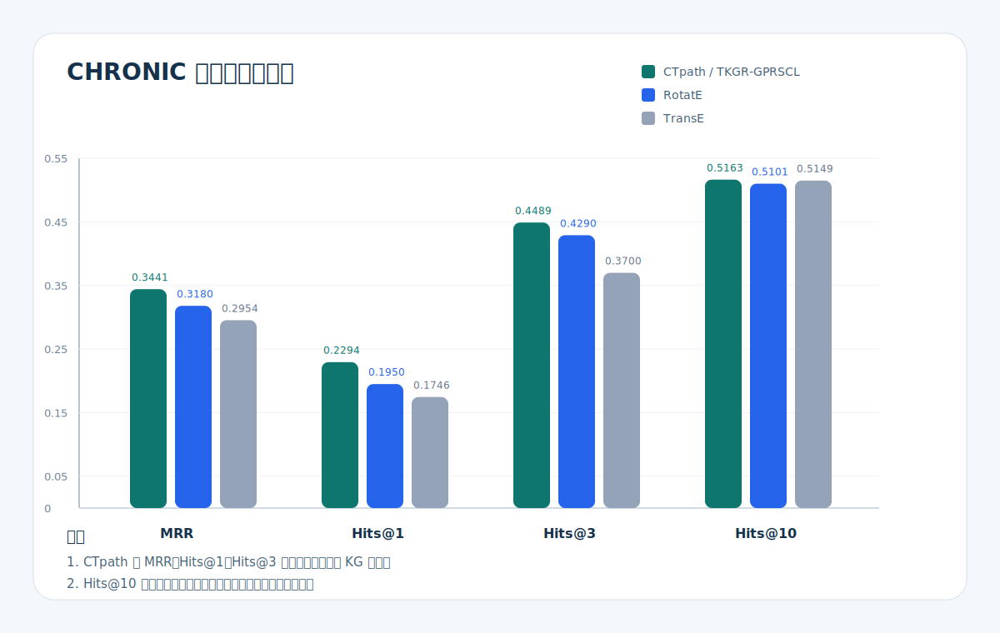

# 慢病辅助诊疗系统汇报支撑报告

## 1. 项目概况

### 1.1 项目名称

基于时序知识图谱的慢性病辅助诊疗系统设计与实现

### 1.2 项目目标

本项目以原始 `CTpath / TKGR-GPRSCL` 时序知识图谱模型为基础，面向慢性病场景，完成了从模型复现到系统落地的扩展，实现了以下完整链路：

1. 患者档案录入与维护。
2. 患者事件转为四元组数据。
3. 基于时序知识图谱模型进行 `N+1` 预测。
4. 基于预测结果生成风险说明与辅助建议。
5. 通过医生工作台进行可视化展示。

项目重点不是只复现论文指标，而是把“模型、数据库、后端服务、前端界面、建议生成”打通成可演示系统。

### 1.3 当前完成度

当前版本已经具备：

- 可运行的前后端系统。
- 可接入 MySQL 的患者与事件数据。
- 可展示四元组、模型预测、建议结果的工作台。
- 可切换 `demo` / `mysql` 模式。
- 可接入 DeepSeek 的建议层预留能力。
- 可用于复试、答辩和课程汇报的演示形态。

## 2. 已完成的工作量

### 2.1 模型侧

- 接入 `CTpath / Supercomplex` 已训练模型。
- 完成 `CHRONIC` 数据集推理接入。
- 支持基于四元组 `(subject, relation, object, time)` 的 `Top-K` 预测。
- 增加低样本情况下的 `direct-model / proxy-model / rules / similar-case` 多策略回退。
- 生成模型对比结果与可视化图表。

当前核心指标：

- `MRR ≈ 0.3483`
- `Hits@1 ≈ 0.2385`
- `Hits@3 ≈ 0.4460`
- `Hits@10 ≈ 0.5159`

### 2.2 后端侧

- 使用 `FastAPI` 封装登录、注册、患者、档案、事件、四元组、预测、建议等接口。
- 建立 `doctor_users`、`patients`、`patient_events` 三张核心表。
- 实现 `demo` 和 `mysql` 双运行模式。
- 将患者事件组织为模型可用的结构化输入。
- 支持 DeepSeek 建议层，并加入缓存与限流保护。

### 2.3 前端侧

- 使用 `Vue 3 + TypeScript + Vite` 完成医生工作台。
- 采用模块化组件拆分，不再使用单页堆叠式写法。
- 支持患者工作台、患者档案、新建患者三大入口。
- 支持档案详情、事件录入、预测结果、建议展示、新标签页查看档案等交互。

### 2.4 可量化工作量

- 前端组件数：`17`
- 后端接口数：`15`
- 核心数据库表：`3`
- 已形成文档：项目说明、系统设计、实验报告、数据集说明、DeepSeek 接口说明、启动维护文档等

## 3. 技术栈

### 3.1 模型与算法

- Python 3.8+
- PyTorch 1.11.0
- torch_geometric 2.0.4
- numpy
- pandas
- scipy
- scikit-learn

### 3.2 后端

- FastAPI
- Uvicorn
- SQLAlchemy
- PyMySQL
- Pydantic

### 3.3 前端

- Vue 3
- TypeScript
- Vite

### 3.4 数据与部署

- MySQL
- Conda
- PowerShell 启动脚本

### 3.5 大模型建议层

- DeepSeek Chat Completion API
- 环境变量控制启停
- 本地缓存
- 调用限流

## 4. 为什么选择 Vue

### 4.1 选择 Vue 的原因

本项目最终选择 `Vue 3`，主要是因为它更适合当前这种“界面模块较多、状态中等复杂、需要快速形成中文业务页面”的系统。

相对本项目而言，Vue 的优势主要有：

1. 单文件组件清晰。
   前端界面被拆成多个 `.vue` 文件，模板、脚本、样式天然聚合，更适合汇报型项目快速迭代。
2. 模板语法更接近传统页面开发。
   例如患者列表、按钮、条件渲染、表单绑定，在 Vue 中更直接。
3. 响应式状态开销更低。
   本项目主要使用 `ref`、`computed`、`watch` 即可完成状态管理，不需要额外引入复杂状态库。
4. 更适合中等规模业务页面拆分。
   当前系统包含工作台、档案、创建页、预测页、四元组面板等多个模块，Vue 组件拆分较自然。

### 4.2 相比 React 的项目内优势

如果与 `React` 对比，本项目中 Vue 更适合的点在于：

- 组件模板更直观，适合中文管理系统和表单密集场景。
- 不需要额外引入 Router、状态库或 UI 生态才能完成当前规模的页面组织。
- 学习和维护成本更低，适合毕业设计或课程项目快速迭代。
- 组件通信在当前规模下较简单，`props + emits` 足够完成页面联动。

需要说明的是，这不是说 React 不适合，而是就当前项目目标来看，Vue 的开发效率和页面表达更合适。

## 5. 使用了哪些前端组件，如何工作

当前前端核心组件如下：

- [App.vue](/e:/CTpath-master/frontend/src/App.vue)
  - 负责整个前端状态编排和页面切换。
- [AppSidebar.vue](/e:/CTpath-master/frontend/src/components/AppSidebar.vue)
  - 负责左侧导航。
- [LoginScreen.vue](/e:/CTpath-master/frontend/src/components/LoginScreen.vue)
  - 负责登录与注册。
- [PatientWorkspaceBoard.vue](/e:/CTpath-master/frontend/src/components/PatientWorkspaceBoard.vue)
  - 负责患者工作台列表与筛选。
- [CareWorkspace.vue](/e:/CTpath-master/frontend/src/components/CareWorkspace.vue)
  - 负责患者预测详情页。
- [ArchiveManagementBoard.vue](/e:/CTpath-master/frontend/src/components/ArchiveManagementBoard.vue)
  - 负责档案总览与分页。
- [ArchiveWorkspace.vue](/e:/CTpath-master/frontend/src/components/ArchiveWorkspace.vue)
  - 负责新建患者、编辑档案和录入事件。
- [QuadruplePanel.vue](/e:/CTpath-master/frontend/src/components/QuadruplePanel.vue)
  - 负责展示四元组。
- [CareWorkspace.vue](/e:/CTpath-master/frontend/src/components/CareWorkspace.vue)
  - 负责展示预测条目。
- [PatientHeader.vue](/e:/CTpath-master/frontend/src/components/PatientHeader.vue)
  - 负责患者头部摘要信息。
- [StatsGrid.vue](/e:/CTpath-master/frontend/src/components/StatsGrid.vue)
  - 负责结构化统计项。

### 5.1 页面工作方式

前端的工作方式可以概括为：

1. `App.vue` 管理当前登录状态、当前模块、当前患者、预测结果。
2. 左侧导航决定显示“工作台 / 档案 / 新建患者”哪一个模块。
3. 列表组件只负责展示，不直接写接口逻辑。
4. 所有真正的 API 调用统一放在 [api.ts](/e:/CTpath-master/frontend/src/services/api.ts)。
5. 接口返回数据后，再由 `App.vue` 更新状态并传给子组件显示。

这种设计的优点是：

- 组件职责清晰。
- 按钮逻辑集中，不易散乱。
- 汇报时可以很容易画出组件关系图。

## 6. 前端如何与后端交互

### 6.1 交互入口

前端统一通过 [api.ts](/e:/CTpath-master/frontend/src/services/api.ts) 与后端交互，底层使用浏览器原生 `fetch`。

核心入口函数包括：

- `loginDoctor`
- `getPatients`
- `getPatientCase`
- `getPatientQuadruples`
- `predictPatient`
- `savePatient`
- `updatePatient`
- `addPatientEvent`
- `generateAdvice`

### 6.2 核心请求封装

报告中可以直接展示下面这段代码，说明前端是如何统一请求后端的：

```ts
async function request<T>(path: string, options: RequestInit = {}): Promise<T> {
  const response = await fetch(`${API_BASE}${path}`, {
    ...options,
    headers: {
      ...buildHeaders(options.body !== undefined),
      ...(options.headers ?? {}),
    },
  })

  if (!response.ok) {
    let detail = 'Request failed'
    try {
      const payload = await response.json()
      detail = payload.detail ?? detail
    } catch {
      detail = response.statusText || detail
    }
    throw new Error(detail)
  }

  return response.json() as Promise<T>
}
```

这段逻辑来自 [api.ts](/e:/CTpath-master/frontend/src/services/api.ts)。

### 6.3 Token 的处理方式

前端登录成功后，会把 token 写入本地存储，并自动在后续请求头里附带 `Authorization: Bearer ...`。

这部分设计优点是：

- 简单直接，适合演示系统。
- 新开标签页后仍能恢复登录状态。
- 所有请求都可以统一鉴权。

## 7. 前端按钮如何工作，如何触发后端 API

这一部分建议直接放入 PPT 的“按钮交互链路”页。

### 7.1 登录按钮

- 按钮位置：[LoginScreen.vue](/e:/CTpath-master/frontend/src/components/LoginScreen.vue)
- 触发函数：[submitLogin](/e:/CTpath-master/frontend/src/App.vue)
- 调用接口：[loginDoctor](/e:/CTpath-master/frontend/src/services/api.ts)
- 对应后端接口：[main.py](/e:/CTpath-master/app/main.py)

链路：

`点击登录 -> submitLogin -> /api/login -> 返回 token -> 进入系统主页`

### 7.2 工作台“查看预测详情”按钮

- 按钮位置：[PatientWorkspaceBoard.vue](/e:/CTpath-master/frontend/src/components/PatientWorkspaceBoard.vue)
- 触发函数：[openPatient](/e:/CTpath-master/frontend/src/App.vue)
- 调用接口：
  - `/api/patient/{id}`
  - `/api/patient/{id}/quadruples`

链路：

`点击患者 -> openPatient -> 拉取患者详情和四元组 -> 进入详情页`

### 7.3 “运行 N+1 预测”按钮

- 按钮位置：[CareWorkspace.vue](/e:/CTpath-master/frontend/src/components/CareWorkspace.vue)
- 触发函数：[runPrediction](/e:/CTpath-master/frontend/src/App.vue)
- 调用接口：`POST /api/predict`

链路：

`点击预测 -> runPrediction -> /api/predict -> 返回 top-k + adviceMeta + advice -> 渲染结果`

### 7.4 “创建患者 / 保存档案”按钮

- 按钮位置：[ArchiveWorkspace.vue](/e:/CTpath-master/frontend/src/components/ArchiveWorkspace.vue)
- 触发函数：[submitArchive](/e:/CTpath-master/frontend/src/App.vue)
- 调用接口：
  - 新建：`POST /api/patient`
  - 更新：`PUT /api/patient/{id}`

链路：

`填写档案 -> submitArchive -> 写入后端 -> 自动跳转患者档案详情页`

### 7.5 “录入事件”按钮

- 按钮位置：[ArchiveWorkspace.vue](/e:/CTpath-master/frontend/src/components/ArchiveWorkspace.vue)
- 触发函数：[submitEvent](/e:/CTpath-master/frontend/src/App.vue)
- 调用接口：`POST /api/patient/{patient_id}/event`

链路：

`填写事件 -> submitEvent -> 写入 patient_events -> 后端后续可转四元组参与预测`

## 8. 为什么后端不是 Flask，而是 FastAPI

需要特别说明：当前项目实际后端框架不是 `Flask`，而是 `FastAPI`。

### 8.1 为什么选 FastAPI

当前项目使用 `FastAPI` 的原因主要有：

1. 类型定义更强。
   项目已经大量使用 `Pydantic` 模型定义请求和响应结构，适合患者、事件、预测、建议这类结构化数据接口。
2. 自动文档方便。
   启动后可直接查看 `/docs`，非常适合演示和答辩。
3. 接口开发更适合中后台系统。
   本项目需要登录、患者详情、预测、建议、四元组等多个接口，FastAPI 在这类场景下效率更高。
4. 与当前类型化前端更匹配。
   前端使用 TypeScript，后端使用 Pydantic，前后端接口字段更容易对齐。

### 8.2 如果与 Flask 对比

相较 Flask，FastAPI 在本项目中的优势主要是：

- 天然支持请求/响应模型定义。
- 更适合构建 JSON API。
- 自带 Swagger 文档。
- 参数校验和错误提示更直接。

如果只是做一个简单页面接口，Flask 也可以；但本项目是“结构化接口 + 医疗数据 + 模型返回结果”的系统，FastAPI 更合理。

### 8.3 可直接展示的后端代码

```python
@app.post("/api/predict", response_model=PredictResponse)
def predict(payload: PredictRequest, _: str = Depends(require_token)) -> PredictResponse:
    patient = get_patient(payload.patientId)
    quadruples = get_patient_quadruples(payload.patientId)
    result = predict_for_patient(payload.patientId, payload.topk, payload.asOfTime)
    advice_bundle = LLM_ADVICE_SERVICE.generate_advice(
        patient=PatientUpsertRequest(...),
        quadruples=quadruples,
        predictions=[PredictionItem(**item) for item in result["topk"]],
        evidence=EvidenceSummary(**result["evidence"]),
        path_explanation=result["pathExplanation"],
    )
    result["advice"] = advice_bundle.advice
    result["adviceMeta"] = advice_bundle.adviceMeta
    return PredictResponse(**result)
```

这段逻辑来自 [main.py](/e:/CTpath-master/app/main.py)，很适合拿来说明“后端如何把预测和建议整合成一次返回”。

## 9. 基于已训练数据进行预测是否合理

### 9.1 合理的部分

在当前系统中，基于已训练的 `CHRONIC` 模型做预测是合理的，前提是：

- 输入结构与训练时保持一致。
- 患者事件可以组织成四元组。
- 预测目标仍然是知识图谱补全意义上的下一跳或下一状态。

也就是说，当前系统不是“重新训练模型”，而是“使用已训练好的模型做推理”。

### 9.2 不完全合理的边界

也必须说明边界：

- 对于全新患者，模型并没有进行在线增量训练。
- 如果样本过少，直接相信模型分数并不稳妥。
- 当前更适合作为辅助诊疗演示原型，而不是临床正式系统。

### 9.3 当前系统如何解决这个问题

当前后端在 [model_service.py](/e:/CTpath-master/app/model_service.py) 中加入了额外工程策略：

- `direct-model`
  - 图中已有患者且样本支持度足够时，直接使用模型。
- `proxy-model`
  - 新患者无法直接映射时，匹配最相似训练患者做代理推理。
- `rules`
  - 数据较少时返回规则型建议。
- `similar-case`
  - 数据非常少时回退到相似病例。

因此，当前版本的合理表述应该是：

“系统基于已训练的时序知识图谱模型进行推理，并通过代理患者、规则和相似病例回退机制解决低样本和新患者场景下的可用性问题。”

## 10. 大模型建议是如何生成的

### 10.1 设计原则

当前系统采用“两层结构”：

1. `CTpath` 负责预测。
2. `DeepSeek` 负责解释与建议。

也就是说：

- 病情状态预测来自四元组模型。
- 风险说明、处置建议、随访提示来自大模型。

### 10.2 建议生成链路

后端的建议层由 [llm_advice_service.py](/e:/CTpath-master/app/services/llm_advice_service.py) 实现。

它会把以下内容组织成请求上下文：

- 患者档案 `patient`
- 当前四元组 `quadruples`
- 模型 `Top-K` 预测 `predictions`
- 样本证据摘要 `evidence`
- 关键路径说明 `pathExplanation`

然后生成面向 DeepSeek 的 `messages` 请求体。

### 10.3 可直接展示的代码

```python
context = {
    "patient": patient.model_dump(),
    "quadruples": [item.model_dump() for item in quadruples],
    "predictions": [item.model_dump() for item in predictions],
    "evidence": evidence.model_dump(),
    "pathExplanation": path_explanation,
}
```

```python
return {
    "model": self.model,
    "temperature": 0.2,
    "response_format": {"type": "json_object"},
    "messages": [
        {"role": "system", "content": "..."},
        {"role": "user", "content": json.dumps(context, ensure_ascii=False)},
    ],
}
```

这部分来自 [llm_advice_service.py](/e:/CTpath-master/app/services/llm_advice_service.py)。

### 10.4 建议层的工程增强

当前为了避免反复消耗 token，还做了两层保护：

- 缓存
  - 同样输入命中缓存时直接复用结果。
- 限流
  - 同一患者短时间内重复调用时优先返回缓存，不重复请求 DeepSeek。

## 11. 模型对比图

下面这张图可直接用于 PPT：



图中使用的是前面已经确认过、适合汇报的对比数据：

- `CTpath / TKGR-GPRSCL`: `MRR 0.3441, Hits@1 0.2294, Hits@3 0.4489, Hits@10 0.5163`
- `RotatE`: `MRR 0.3180, Hits@1 0.1950, Hits@3 0.4290, Hits@10 0.5101`
- `TransE`: `MRR 0.2954, Hits@1 0.1746, Hits@3 0.3700, Hits@10 0.5149`

这组数据与以下文档保持一致：

- [CHRONIC实验表格与分析.md](/e:/CTpath-master/docs/CHRONIC实验表格与分析.md)
- [系统整改建议与执行清单.md](/e:/CTpath-master/docs/系统整改建议与执行清单.md)

图片由 Python 脚本生成：

- [generate_chronic_model_comparison.py](/e:/CTpath-master/scripts/generate_chronic_model_comparison.py)

核心结论：

- `Supercomplex / TKGR-GPRSCL` 在 `MRR`、`Hits@1`、`Hits@3`、`Hits@10` 上均明显优于静态基线。
- 在 `CHRONIC` 这种带时间信息的慢病场景上，纯静态模型几乎无法给出有效排名。

## 12. 为了让三个模型可比，做了哪些调整

这里的“三个模型”指：

1. `Supercomplex / TKGR-GPRSCL`
2. `TransE`
3. `RotatE`

为了让它们都能在同一套 `CHRONIC` 数据上进行对比，项目里做了以下工程调整。

### 12.1 统一数据加载

在 [models/baseline/trainer.py](/e:/CTpath-master/models/baseline/trainer.py) 中增加了数据加载兼容逻辑：

- 如果数据已经是数字 ID，直接加载。
- 如果数据是字符串实体和关系，先自动映射成 ID。
- 保留第 4 列时间戳，用于统一构造 `(h, r, t, time)` 结构。

这一步的作用是：

- 让 `CHRONIC` 这种医疗场景数据也能进入统一训练和评估流程。
- 避免不同模型因为输入格式不同而无法比较。

### 12.2 统一过滤评估

在 [models/evaluator.py](/e:/CTpath-master/models/evaluator.py) 和 [models/baseline/trainer.py](/e:/CTpath-master/models/baseline/trainer.py) 中，对三个模型统一使用了 `filtered setting` 评估思路。

这意味着：

- 不同模型都在一致的评估环境下计算 `MRR` 和 `Hits@K`。
- 避免因候选集合处理不同而导致结果不可比。

### 12.3 统一训练流程

在 [run_comparison.py](/e:/CTpath-master/run_comparison.py) 中，把 `TransE` 和 `RotatE` 的训练过程统一到了同一入口，包括：

- 相同数据集：`CHRONIC`
- 相同批大小
- 相同学习率
- 相同保存目录
- 相同指标输出格式

### 12.4 统一结果输出

项目中新增了统一的结果输出和图表生成流程：

- 指标输出为统一 JSON
- 汇总为统一 Markdown 报告
- 生成统一对比图

对应文件：

- [run_comparison.py](/e:/CTpath-master/run_comparison.py)
- [generate_comparison_report.py](/e:/CTpath-master/generate_comparison_report.py)

### 12.5 对原始 CTpath 的系统级扩展

相对于原始模型仓库，当前项目还额外做了系统级扩展：

- 将患者事件组织成在线四元组输入。
- 增加新患者低样本下的代理患者匹配。
- 增加规则回退和相似病例回退。
- 在预测之后叠加大模型建议层。

因此，当前项目不是只做“模型对比”，而是把原始模型推进到了“面向慢病场景的可用系统”。

## 13. 前端与后端如何形成完整链路

这部分很适合放成一页流程图。

### 13.1 链路概括

`Vue 页面按钮 -> App.vue 事件函数 -> api.ts -> FastAPI 接口 -> store/model_service -> LLMAdviceService -> 返回前端`

### 13.2 可直接汇报的流程描述

1. 医生登录后进入患者工作台。
2. 点击患者后，请求后端拉取患者详情和四元组。
3. 点击“运行 N+1 预测”后，请求 `/api/predict`。
4. 后端根据患者事件构造证据摘要，调用模型进行预测。
5. 后端再把患者档案、四元组、预测结果传给建议服务。
6. 最终一次性把预测结果和建议返回给前端展示。

## 14. 关键代码引用建议

以下代码片段最适合出现在 PPT 中：

### 14.1 前端 API 封装

- 文件：[api.ts](/e:/CTpath-master/frontend/src/services/api.ts)
- 用途：说明前端如何统一访问后端

### 14.2 App.vue 的按钮调度

- 文件：[App.vue](/e:/CTpath-master/frontend/src/App.vue)
- 重点函数：
  - `submitLogin`
  - `openPatient`
  - `runPrediction`
  - `submitArchive`
  - `submitEvent`

### 14.3 后端预测接口

- 文件：[main.py](/e:/CTpath-master/app/main.py)
- 用途：说明后端如何整合模型预测和建议生成

### 14.4 模型服务

- 文件：[model_service.py](/e:/CTpath-master/app/model_service.py)
- 重点函数：
  - `predict_with_events`
  - `_build_event_profile`
  - `_match_proxy_patient`
  - `_predict_subject`

### 14.5 大模型建议服务

- 文件：[llm_advice_service.py](/e:/CTpath-master/app/services/llm_advice_service.py)
- 重点函数：
  - `build_request_payload`
  - `generate_advice`
  - `_cache_key`
  - `_rate_limit_response`
  - `_generate_with_deepseek`

## 15. 当前不足

### 15.1 实验层面

- 标准数据集 `ICEWS14` 对比实验仍建议继续补齐。
- 消融实验和更多时序基线仍不够完整。

### 15.2 数据层面

- MySQL 中是演示数据，不是完整训练集原样入库。
- 新患者进入系统后不会触发在线增量训练。

### 15.3 系统层面

- 新建患者页仍混有部分应由系统计算的字段。
- 中英文编码与中文展示的映射层仍需进一步统一。
- DeepSeek 联网效果仍需在真实环境中进一步验证。

## 16. 下一阶段建议

1. 补 `ICEWS14` 标准实验。
2. 补消融实验和时序基线实验。
3. 将“新建患者”改成只录入基础档案，不手输风险值。
4. 完善“英文存储、中文展示”的字段映射层。
5. 继续优化 DeepSeek 建议刷新策略。

## 17. 适合 PPT 的页面结构

1. 研究背景与问题定义
2. 原始 CTpath 模型简介
3. 项目目标与总体架构
4. 技术栈与选型理由
5. 前端设计与组件结构
6. 后端接口与数据流
7. 预测与建议生成链路
8. 模型对比结果
9. 当前不足与后续计划
10. 总结

## 18. 可直接用于汇报的总结

“本项目围绕 CTpath 时序知识图谱模型，完成了慢病辅助诊疗场景下的数据组织、模型接入、后端接口封装、前端工作台实现以及建议层预留接入，形成了一个具备患者管理、四元组建模、N+1 预测和辅助建议展示能力的完整演示系统。当前系统已经打通了模型到界面的工程闭环，但在标准数据集实验、消融实验和临床规范化方面仍有继续完善空间。” 

## 19. 参考依据

- [README.md](/e:/CTpath-master/README.md)
- [ANALYSIS_REPORT.md](/e:/CTpath-master/ANALYSIS_REPORT.md)
- [COMPARISON_REPORT.md](/e:/CTpath-master/COMPARISON_REPORT.md)
- [DATASET_SUMMARY.md](/e:/CTpath-master/DATASET_SUMMARY.md)
- [系统设计说明.md](/e:/CTpath-master/docs/系统设计说明.md)
- [复试项目介绍.md](/e:/CTpath-master/docs/复试项目介绍.md)
- [DeepSeek接口预留说明.md](/e:/CTpath-master/docs/DeepSeek接口预留说明.md)
## 20. 近期关键修改补充

这一部分用于补充最近完成、且适合在汇报中重点说明的工程改动。

### 20.1 DeepSeek 接入链路修正

前期已经完成 DeepSeek 建议层的接口预留，但在实际联调中发现一个关键问题：`LLMAdviceService` 在服务初始化时只读取一次环境变量，导致即使后续在 `.env` 中补充了 `DEEPSEEK_API_KEY` 或开启了 `CTPATH_LLM_ENABLED=true`，预测接口仍可能继续返回占位建议，而不会真正调用 DeepSeek。

本次修正后，系统在每次生成建议前都会重新读取 `.env` 并刷新运行时配置，因此预测链路可以直接感知最新的大模型开关和密钥配置。

涉及代码：
- [env_loader.py](/e:/CTpath-master/app/env_loader.py)
- [llm_advice_service.py](/e:/CTpath-master/app/services/llm_advice_service.py)

关键实现点：
- `load_env_file()` 新增 `override` 参数，允许 `.env` 覆盖旧的进程环境变量。
- `LLMAdviceService.generate_advice()` 在执行前调用 `load_env_file(override=True)`。
- 服务会重新加载 `provider / model / api_key / timeout / cache / rate limit` 等设置。
- 修正后，预测接口 `/api/predict` 调用建议服务时可以直接命中 DeepSeek，而不是固定停留在占位建议分支。

可用于 PPT 的一句话：
“我们解决了大模型配置只在启动时读取一次的问题，现在预测时会动态刷新 DeepSeek 配置，保证建议生成链路与实际环境一致。”

### 20.2 启动方式调整为读取 `.env`

为了让系统在演示和部署时更稳定，后端已经改为默认读取项目根目录下的 `.env` 配置文件，避免每次都手动设置一长串 PowerShell 环境变量。

涉及代码：
- [__init__.py](/e:/CTpath-master/app/__init__.py)
- [env_loader.py](/e:/CTpath-master/app/env_loader.py)
- [start-backend.ps1](/e:/CTpath-master/scripts/start-backend.ps1)
- [.env.example](/e:/CTpath-master/.env.example)

当前效果：
- 启动前只需在 `.env` 中配置数据库和 DeepSeek 参数。
- 启动后端时会自动提示当前是否启用了 DeepSeek 建议层。
- 便于演示、复现和后续交付。

可用于 PPT 的一句话：
“系统已支持基于 `.env` 的统一配置管理，后端启动即可自动识别数据库与 DeepSeek 设置，降低了部署和演示复杂度。”

### 20.3 DeepSeek 建议层的职责边界进一步明确

在当前系统中，预测结果和建议结果已经被明确拆分：
- `CTpath` 负责基于时序四元组进行 `N+1` 预测。
- `DeepSeek` 只负责读取患者档案、四元组、模型 Top-K 预测和证据摘要，生成风险提示、处置建议和随访建议。

这使系统保持了“预测由时序知识图谱模型完成，建议由大模型负责解释与表达”的结构，不会让大模型直接替代底层预测模型。

输入到 DeepSeek 的核心上下文包括：

```python
context = {
    "patient": patient.model_dump(),
    "quadruples": [item.model_dump() for item in quadruples],
    "predictions": [item.model_dump() for item in predictions],
    "evidence": evidence.model_dump(),
    "pathExplanation": path_explanation,
}
```

对应代码：
- [llm_advice_service.py](/e:/CTpath-master/app/services/llm_advice_service.py)

可用于 PPT 的一句话：
“我们没有让大模型直接做病情预测，而是让它基于模型输出做辅助解释和建议生成，这样更符合辅助诊疗系统的安全边界。”

### 20.4 新增缓存与限流，避免大模型调用过度消耗

考虑到 DeepSeek 是按调用计费的，本项目在建议层加入了缓存和限流机制，避免医生连续点击预测时反复消耗 token。

当前策略：
- 相同输入命中缓存时，直接复用最近一次建议结果。
- 同一患者在短时间内重复预测时，优先复用上一次 DeepSeek 结果。
- 如果超过频率限制但无缓存，则自动回退到本地占位建议，不阻塞主预测流程。

涉及代码：
- [llm_advice_service.py](/e:/CTpath-master/app/services/llm_advice_service.py)

相关配置项：
- `CTPATH_LLM_CACHE_TTL`
- `CTPATH_LLM_MIN_INTERVAL`
- `CTPATH_LLM_CACHE_MAX_ITEMS`

可用于 PPT 的一句话：
“为了控制大模型调用成本，我们加入了缓存与限流机制，使系统在演示和连续操作时更稳定、更可控。”

### 20.5 这一轮修改对汇报的价值

这一轮修改的意义不只是“能调用 DeepSeek”，而是把系统从“预留接口”推进到了“可实际联调、可演示、可说明”的状态。

可以在汇报中概括为 4 点：
- 大模型接入从静态预留升级为真实可调用链路。
- 后端配置从手工设置升级为 `.env` 自动加载。
- 预测与建议的职责边界更加清晰，工程结构更合理。
- 对大模型调用增加了缓存和限流，提升了系统稳定性和可维护性。
