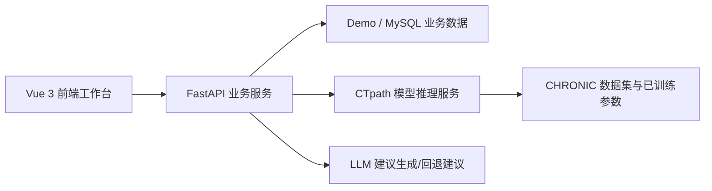

# 重庆邮电大学本科毕业设计（论文）初稿

## 封面信息

- 论文题目：基于时序知识图谱的慢病辅助诊疗业务系统设计与实现
- 学院：`【待填写】`
- 专业：`【待填写】`
- 班级：`【待填写】`
- 学号：`【待填写】`
- 学生姓名：`【待填写】`
- 指导教师：`【待填写】`
- 完成时间：2026年4月

---

## 摘要

慢性疾病具有病程长、随访频繁、病情演化复杂和管理周期长等特点，传统单次门诊记录难以完整反映患者病程变化规律。随着医疗信息化建设的推进，如何将时序知识图谱推理模型与真实业务场景结合，形成可运行、可演示、可扩展的辅助诊疗系统，成为医学信息工程与医疗人工智能交叉领域的重要研究方向。针对现有研究中“模型效果与业务系统脱节”“算法结果难以被医生直接使用”“演示系统缺乏完整业务闭环”等问题，本文设计并实现了一套面向慢病管理场景的辅助诊疗业务系统。

本文以 CTpath 时序知识图谱推理模型为基础，围绕慢病患者管理业务，构建了“医生业务端 + 模型推理服务 + 数据治理与随访闭环”的系统原型。系统前端采用 Vue 3、TypeScript、Pinia、Vue Router 和 Element Plus 实现，后端采用 FastAPI 构建认证、患者管理、预测推理、附件管理、药品目录、药品权限和随访服务接口，并支持 demo 与 MySQL 两种运行模式。系统面向医生、护士、档案员等角色，提供登录认证、患者列表、患者详情、电子档案、当前用药、风险预测、建议生成、随访任务和治理支撑等功能。为增强系统可用性，本文在预测服务中设计了 direct-model、proxy-model、rules、similar-case 等多策略回退机制，使系统在低样本或模型不可用场景下仍能输出辅助建议。

在实现层面，本文重点完成了患者详情页中的真实预测触发链路、登录到工作台的最小闭环、档案附件与随访管理等核心功能，并对模型输出结果、证据摘要、建议来源和状态降级进行了结构化展示。系统测试结果表明，当前原型已能够完成“登录—患者检索—病程查看—预测分析—建议生成—随访任务创建”的基本业务闭环；在 CHRONIC 数据集上的实验结果显示，模型在 MRR、Hits@1、Hits@3、Hits@10 等指标上具有一定预测能力，可为慢病病程演化分析提供辅助参考。本文的工作表明，将时序知识图谱推理模型嵌入慢病辅助诊疗工作流，能够在保证工程可落地性的同时，提升预测结果的可解释性与业务可用性。

关键词：慢病辅助诊疗；时序知识图谱；CTpath；FastAPI；Vue 3；医疗信息化

---

## Abstract

Chronic disease management is characterized by long treatment cycles, continuous follow-up, and complex temporal progression. Traditional single-visit records are often insufficient for representing longitudinal clinical changes. To bridge the gap between temporal knowledge graph reasoning models and practical medical workflows, this thesis designs and implements a chronic disease assistant diagnosis and treatment system based on CTpath.

The system integrates a temporal knowledge graph reasoning model with a clinical workstation prototype. The frontend is implemented with Vue 3, TypeScript, Pinia, Vue Router and Element Plus, while the backend is implemented with FastAPI to provide authentication, patient management, prediction, attachment management, medication catalog, medication permission, and follow-up services. The system supports doctor, nurse, and archivist roles, and provides a functional workflow including login, patient review, patient detail browsing, temporal event timeline display, risk prediction, advice generation, follow-up task management, and governance support.

To improve engineering robustness, the prediction service introduces multiple fallback strategies such as direct-model, proxy-model, rules, and similar-case. As a result, the system can still generate interpretable assistance when the model is degraded or the available structured data is limited. Experimental and functional verification shows that the current prototype is able to complete the key workflow from login to prediction and follow-up, and the model achieves usable ranking performance on the CHRONIC dataset.

Key words: chronic disease assistant diagnosis and treatment; temporal knowledge graph; CTpath; FastAPI; Vue 3; medical informatics

---

## 目录

1. 绪论  
2. 相关技术与理论基础  
3. 系统需求分析  
4. 系统总体设计  
5. 系统详细实现  
6. 系统测试与结果分析  
7. 总结与展望  
参考文献  
致谢

---

# 第一章 绪论

## 1.1 研究背景

慢性疾病已成为影响居民健康水平的重要因素之一，糖尿病、帕金森病、阿尔茨海默病等疾病往往具有病程长、诊疗过程复杂、复诊与随访频繁、照护因素影响显著等特征。与急性疾病相比，慢病管理更强调连续观察和长期干预，单次门诊记录通常只能反映患者某一时间点的状态，难以支持对病程演化趋势的判断。

在医疗信息化建设过程中，大量业务系统更关注挂号、收费、住院、药房、医保等综合医院管理流程，而面向慢病专病管理的辅助诊疗工作站仍然相对薄弱。尤其是在科研系统或毕业设计项目中，常见问题是：一方面已有时序知识图谱模型可以对疾病演化进行预测，另一方面业务系统界面与数据流却往往无法承载模型结果，使算法与业务两张皮，难以形成完整的诊疗闭环。

因此，围绕“慢病辅助诊疗”这一明确场景，设计一套能够将患者病程数据、时序知识图谱模型推理结果、辅助建议和随访任务有效串联起来的业务系统，既具有一定的学术研究意义，也具有较强的工程实践价值。

## 1.2 研究意义

本文的研究意义主要体现在以下几个方面：

1. 理论意义。将时序知识图谱推理方法迁移到慢病辅助诊疗场景，对“医疗时序事件如何表达”“模型推理如何与临床工作流衔接”等问题进行了工程化探索。
2. 应用意义。相比单纯展示模型指标，本文将模型能力嵌入患者详情、建议生成和随访任务中，更符合实际医疗工作站的使用逻辑。
3. 工程意义。本文强调前后端分层、认证权限、异常处理、回退机制和可演示闭环，能够为类似医疗人工智能原型系统的开发提供可参考的实现思路。

## 1.3 国内外研究现状

在知识图谱推理研究方面，TransE、RotatE 等嵌入方法为知识图谱补全提供了经典基础。随着时序信息的引入，研究者进一步提出面向时序知识图谱的推理模型，使实体关系不再仅依赖静态语义，而能够结合时间变化进行建模。CTpath 对图结构路径表示、时间建模和监督式对比学习进行了融合，为病程演化预测提供了新的方法基础。

在医疗信息化系统建设方面，综合 HIS 与 EMR 已较为成熟，但多数系统偏重事务管理，对模型辅助、时序演化预测和病程推理支持不足。与此同时，一些医学人工智能研究虽在算法指标上取得较好效果，但往往缺少真实业务工作台，难以支撑医生理解和使用模型输出。

综上可见，当前仍缺乏一类同时具备以下特点的原型系统：一是面向慢病连续管理场景；二是能够以结构化病程事件作为模型输入；三是可将预测结果、证据摘要、建议与随访任务打通形成闭环。本文正是在这一背景下展开研究与实现。

## 1.4 研究内容

本文围绕“基于时序知识图谱的慢病辅助诊疗业务系统”开展工作，主要研究内容如下：

1. 梳理慢病辅助诊疗场景中的角色需求、功能需求和非功能需求。
2. 设计“前端工作台 + 后端业务服务 + 模型推理服务”的系统总体架构。
3. 构建患者档案、病程事件、附件、药品目录、随访任务等核心业务数据组织方式。
4. 将 CTpath 时序知识图谱推理结果接入患者详情页，实现预测结果、证据摘要和建议生成展示。
5. 完成登录、患者详情、预测分析、随访任务、电子档案和药品权限等模块实现。
6. 通过功能测试、接口验证和模型指标结果，对系统可用性进行分析。

## 1.5 论文结构安排

全文共分为七章。第一章介绍研究背景、意义和研究内容；第二章介绍系统使用的关键技术；第三章分析系统需求；第四章给出系统总体设计；第五章介绍系统关键模块实现；第六章给出系统测试与结果分析；第七章总结全文并提出后续展望。

---

# 第二章 相关技术与理论基础

## 2.1 时序知识图谱推理技术

时序知识图谱通常将事实表示为四元组 $(s,r,o,t)$，其中 $s$ 表示主语实体，$r$ 表示关系，$o$ 表示客体实体，$t$ 表示时间戳。与静态知识图谱相比，时序知识图谱能够表达事实随时间变化的过程，更适合描述慢病患者的病程演化、依从性变化、支持系统变化和风险变化等连续信息。

本文所依托的 CTpath 模型在时序知识图谱推理的基础上，结合图结构感知路径表示和监督式对比学习，使模型不仅能够利用实体、关系和时间的嵌入信息，还能够综合病程路径结构信息进行预测。对于医疗场景而言，这意味着模型并非只关注某一条独立事件，而是能够考虑“疾病阶段变化—依从性下降—风险上升”这一类连续路径模式，从而更适合病程辅助分析。

## 2.2 Vue 3 前端框架

Vue 3 具有组件化清晰、模板语法直观、响应式状态管理简洁等优点，适合构建中等复杂度的业务工作台系统。本文前端采用 Vue 3 作为核心框架，使用 TypeScript 强化类型约束，使用 Vue Router 管理页面路由，使用 Pinia 管理认证态与工作台状态，配合 Element Plus 构建表单、表格、对话框和状态提示组件。

在本项目中，Vue 3 的主要价值体现在：

1. 能够较自然地完成登录页、医生工作台、患者详情、电子档案、随访工作台等多页面拆分。
2. 通过 `ref`、`computed`、`watch` 等机制实现页面状态同步，降低了复杂状态库的引入成本。
3. 有利于快速搭建接近真实医院工作站的信息密度和业务交互。

## 2.3 FastAPI 后端框架

FastAPI 是一个基于 Python 的现代 Web 框架，具有类型提示清晰、接口文档自动生成、JSON API 开发效率高等优点。本文后端采用 FastAPI 的原因主要有以下几点：

1. 便于使用 Pydantic 定义患者、事件、预测结果、建议等结构化模型。
2. 便于快速构建 RESTful API，并通过 `/docs` 自动生成接口文档。
3. 适合毕业设计中需要快速实现“可运行系统”的目标。
4. 能够较方便地接入认证、限流、异常处理和中间件治理逻辑。

## 2.4 MySQL 与 Demo 双模式

考虑到答辩演示和开发调试的需要，本文系统同时支持 demo 模式与 MySQL 模式。未配置数据库连接时，系统可加载内置演示数据，保证功能链路完整；配置 MySQL 后，可切换到结构化业务数据源，增强系统的真实感和可扩展性。

这种双模式设计能够兼顾以下两个目标：一是保障演示环境稳定可用；二是为后续真实数据库接入与业务扩展保留空间。

## 2.5 医疗系统中间件与治理能力

医疗信息系统需要对认证、权限、异常、审计和链路追踪等内容进行治理。本文在后端原型中引入了 JWT 认证、TraceId 中间件、全局异常处理中间件、限流逻辑和权限校验能力，使系统不仅停留在界面演示层面，还具有一定的工程规范基础。

---

# 第三章 系统需求分析

## 3.1 业务场景分析

本系统聚焦慢病辅助诊疗场景，而非完整综合 HIS。系统的主要使用对象包括医生、护士和档案员等角色，核心业务围绕患者连续管理展开，主要包括患者建档、病程维护、风险预测、辅助建议、随访任务与治理支撑。

从业务流程上看，医生首先登录系统进入工作台，查看待处理患者摘要；随后进入患者详情页查看病程时间线、当前用药和模型预测结果；如发现存在高风险或需要进一步干预，可创建随访任务并交由护士跟进；护士在随访工作台中完成联系记录和任务状态更新；档案员则维护患者附件、身份资料和电子档案信息。

## 3.2 功能需求分析

### 3.2.1 登录与认证需求

系统需要支持医生、护士、档案员等多角色登录，并在登录成功后恢复会话状态。未登录状态下访问受保护页面，应自动跳转到登录页。

### 3.2.2 医生工作台需求

医生首页需要展示待处理患者列表、患者摘要和主要入口操作，不应堆叠过多治理看板或训练中心内容。其主要目标是帮助医生快速定位患者并进入详情分析。

### 3.2.3 患者详情需求

患者详情页是系统核心页，需要同时支持以下信息展示与操作：

1. 患者基础信息和病案编号；
2. 病程时间线和重点事件；
3. 当前用药与评估；
4. 风险预测结果与证据摘要；
5. 辅助建议与建议来源；
6. 进入随访模块的操作入口；
7. 电子档案附件预览。

### 3.2.4 随访工作台需求

随访模块需要支持待随访任务列表、联系记录、随访状态更新和下次计划管理，以形成医生诊疗到护士随访的业务闭环。

### 3.2.5 档案与附件需求

电子档案模块需要支持患者照片、身份证、医保卡、转诊单、检查报告、知情同意书等附件类型，并记录上传时间、上传人和附件类型。

### 3.2.6 药品与权限需求

系统需要支持药品目录、剂型规格、是否处方药、是否管制药、药品状态等信息，同时支持医生、护士、药师、档案员、管理员等角色的药品权限映射。

### 3.2.7 模型辅助需求

系统需要支持基于患者当前病程事件触发真实预测请求，并展示 Top-K 风险事件、证据摘要、路径说明和辅助建议。同时系统要明确区分“预置摘要”与“真实预测结果”，避免用户误判。

## 3.3 非功能需求分析

### 3.3.1 可用性需求

系统应支持 demo 模式运行，保证在数据库不可用或现场环境受限时仍可演示主要业务链路。

### 3.3.2 安全性需求

系统应支持 JWT 认证、权限控制、接口鉴权、审计日志和请求链路标识。

### 3.3.3 可维护性需求

系统应在前端页面、后端接口和服务模块层面保持职责清晰，避免将医生工作台、治理页面和模型训练页面混在同一主内容区中。

### 3.3.4 可扩展性需求

系统应为后续模型管理端、训练中心、数据集管理和独立模型服务扩展保留接口与架构边界。

---

# 第四章 系统总体设计

## 4.1 总体架构设计

系统总体采用“前端业务工作台 + 后端业务服务 + 模型推理能力”的分层结构。其核心思路是：前端负责医生、护士和档案员的业务操作展示；后端负责认证、患者、附件、随访、药品和预测接口组织；模型层负责时序知识图谱推理及多策略回退。

上述设计具有以下优点：

1. 前后端分离清晰，便于后续扩展。
2. 模型服务并未直接暴露给医生，而是通过业务服务统一封装输出。
3. 支持 demo 和 MySQL 两种模式，有利于演示与开发共存。

## 4.2 系统功能结构设计

根据项目现状，系统当前功能结构可概括为：

1. 登录认证模块；
2. 医生工作台模块；
3. 患者详情模块；
4. 患者档案与附件模块；
5. 护士随访工作台模块；
6. 药品目录管理模块；
7. 药品权限管理模块；
8. 预测与建议生成模块；
9. 治理支撑模块。

其中，患者详情模块是系统核心，因为它承担了患者信息查看、病程时间线、模型结果解释、建议展示和随访跳转等关键功能。

## 4.3 角色与权限设计

系统当前至少支持以下角色：

1. 医生：负责患者查看、预测分析、档案查看、建议判读和随访任务发起；
2. 护士：负责随访任务执行、联系记录登记和状态维护；
3. 档案员：负责患者建档、身份信息维护和附件管理；
4. 药师/管理员：在药品权限模块中进行角色级权限展示与后续扩展。

在权限设计上，系统采用“认证 + 路由保护 + 接口鉴权 + RBAC 依赖校验”的思路，避免不同角色越权访问敏感接口。

## 4.4 数据库与数据结构设计

### 4.4.1 核心业务数据

系统围绕患者生命周期组织数据，主要包括：

1. 患者基础信息；
2. 病程事件；
3. 当前用药；
4. 随访任务；
5. 联系记录；
6. 患者附件；
7. 药品目录与药品权限。

### 4.4.2 关键表设计

本文系统主要业务表包括：

- `doctor_users`：医生及其他角色账号信息；
- `patients`：患者基本信息；
- `patient_events`：患者病程事件；
- 其他扩展表：随访、附件、药品目录和权限映射等。

### 4.4.3 模型输入组织

为适配 CTpath 模型，系统将病程事件转换为时序知识图谱四元组形式，即 `(subject, relation, object, time)`。例如，患者在某一时间点的疾病阶段、依从性、支持系统变化等均可转化为结构化关系事件，从而为后续预测服务提供输入。

## 4.5 接口设计

当前系统关键接口包括：

- `POST /api/login`：用户登录；
- `GET /api/patients`：获取患者列表；
- `GET /api/patient/{id}`：获取患者详情；
- `POST /api/predict`：触发患者预测；
- `GET /api/health`：获取系统运行模式与模型状态；
- 附件、药品、随访、治理相关接口。

预测接口的设计重点在于：一次请求同时返回预测结果、证据摘要、路径说明和辅助建议，从而减少前端多次拼装，提高医生阅读效率。

## 4.6 回退与降级策略设计

真实医疗场景中，模型并非始终可用，患者结构化数据也未必充分。因此本文在业务层设计了多策略回退机制：

1. `direct-model`：当数据充分且模型可用时，直接返回模型结果；
2. `proxy-model`：患者无法直接映射时，寻找相似患者进行代理推理；
3. `rules`：数据量较少时返回规则型建议；
4. `similar-case`：模型不足时回退到相似病例辅助。

该设计保证了系统在演示和原型阶段的稳定性，也提升了工程鲁棒性。

---

# 第五章 系统详细实现

## 5.1 登录认证模块实现

登录页采用独立路由实现，用户通过输入账号密码进入业务工作台。前端通过 Pinia 保存认证状态，并在路由守卫中校验会话是否有效；后端通过 JWT 令牌维持用户身份。在退出登录时，系统会清理本地 session，并强制回到登录页，避免停留在无效工作台状态。

该模块实现了以下目标：

1. 登录页与业务工作台壳层分离；
2. 登录成功后自动跳转首页；
3. 未登录访问受保护路由时自动重定向；
4. 退出登录后清理患者状态、预测状态和当前用户状态。

## 5.2 医生工作台实现

医生工作台负责展示待处理患者列表、风险提示和主要操作入口。其实现重点不在于复杂图表，而在于帮助医生快速定位患者并进入详情页。在前端中，医生工作台页面由列表区、摘要区和操作区构成，能够响应搜索、筛选和患者打开等动作。

这一模块的价值在于，它将传统“后台首页”的泛化信息压缩为面向诊疗业务的高频入口，使工作台更接近真实医院专病管理界面。

## 5.3 患者详情与预测模块实现

患者详情页是本文实现的重点模块。该页面围绕当前患者组织信息，主要包括三部分：

1. 左侧区域：患者基础信息、生命体征、重点化验指标和电子档案附件；
2. 中间区域：病程时间线、证据摘要、路径说明；
3. 右侧区域：当前用药、评估建议、随访入口和预测结果。

当用户首次进入详情页时，系统可展示患者的预置摘要，用于保持页面初始完整性；但只有点击“触发预测”按钮后，前端才会调用真实 `POST /api/predict` 接口，并以返回的 `workspace.predictionResult` 作为优先展示数据源。页面状态被明确区分为“初始预置摘要”“预测中”“最新预测结果”“预测失败”等几种情况，从而避免医生将占位内容误认为真实模型输出。

在实现逻辑上，前端通过统一控制器调用预测服务，后端则在预测接口中完成患者数据读取、事件组织、模型推理、证据构建和建议生成，最终一次性返回结构化预测响应。

## 5.4 建议生成与解释模块实现

预测结果本身往往难以直接被医生理解，因此本文在预测接口后追加了建议生成逻辑。该逻辑综合患者信息、病程事件、预测结果和证据摘要，输出医生可读的风险提示与随访建议。

系统中的建议生成采取两层设计：

1. 当大模型服务可用时，生成更自然的医生可读建议；
2. 当外部服务不可用时，回退到本地规则建议，确保系统不因单点能力失效而中断。

这一设计体现了“辅助诊疗系统”而非“单纯算法演示”的目标。

## 5.5 电子档案与附件模块实现

患者档案模块负责患者身份信息、联系方式、紧急联系人和建档状态等内容；附件模块则负责患者照片、身份证照片、医保卡照片、检查报告、转诊单和知情同意书等文件的管理。系统支持附件列表加载、上传、摘要展示和预览。

与仅保留头像字段的简单做法相比，本文将附件视为独立业务对象处理，更符合真实医疗档案管理场景。

## 5.6 随访工作台实现

在慢病管理中，诊疗行为并不止于门诊查看，随访才是真正保障连续管理的关键环节。为此，本文实现了护士随访工作台，用于查看待随访任务、未接通联系、医生复核队列以及联系记录。医生在患者详情页可直接进入随访模块，实现“预测—建议—随访”的动作链路。

该模块使系统从单纯“展示预测结果”进一步演化为“可执行后续动作”的工作流系统。

## 5.7 药品目录与药品权限实现

药品目录管理模块用于展示药品通用名、剂型规格、处方属性、管制属性和状态信息；药品权限模块则从角色维度展示医生、护士、药师等角色对不同药品的使用权限。

这一设计的作用在于，使系统不仅停留在病程预测层面，而且能够将“当前用药”“药品权限”和患者管理场景联系起来，增强原型系统的医疗业务完整性。

## 5.8 模型管理与治理支撑实现

在当前项目阶段，模型侧能力主要体现为模型预测、建议生成、健康状态判断、调用回退和治理页面展示。系统已具备模型看板、模型运营页和训练相关原型的拆分基础，但从工程状态看，模型管理端仍处于持续完善阶段。因此本文在论文中将其表述为“模型治理与管理能力原型”，重点说明其设计思路和接口边界，而不将其描述为完全成熟的独立产品。

这种写法既符合当前代码实现情况，也更适合毕业设计阶段的真实表述。

---

# 第六章 系统测试与结果分析

## 6.1 测试环境

系统测试环境如下：

- 操作系统：Windows 开发环境；
- 前端：Vue 3 + Vite；
- 后端：FastAPI + Uvicorn；
- Python 环境：Conda；
- 数据模式：demo / MySQL 双模式；
- 主要测试方式：前端构建测试、页面交互测试、接口合同测试、后端语法检查和业务链路人工验收。

## 6.2 功能测试

围绕当前实现，本文重点对以下业务闭环进行了测试：

1. 登录后进入业务工作台；
2. 从工作台打开患者详情；
3. 在患者详情页触发真实预测；
4. 展示最新预测结果与建议；
5. 进入随访工作台查看任务与联系记录；
6. 退出登录后返回登录页。

当前测试结果表明，医生端最小业务闭环已经具备可演示性，能够完成“登录—工作台—患者详情—预测—建议—随访入口—退出登录”的基础路径。

## 6.3 接口与后端合同验证

项目后端已对关键接口开展合同验证，核心包括：

1. 登录接口返回用户信息与 token；
2. 患者接口返回列表与详情结构；
3. 预测接口返回 `patientId`、`mode`、`strategy`、`topk`、`advice` 等关键字段；
4. 中间件可在未登录时返回正确的认证错误，并附带追踪信息。

从系统实现角度看，这些验证能够说明后端并非仅有静态演示数据，而是已经具备基本接口契约和治理能力。

## 6.4 模型结果分析

在 CHRONIC 数据集上的已有实验结果表明，CTpath 模型在时序病程预测任务上具有一定可用性。结合现有实验记录，可将结果概括为：

- MRR 约为 0.34；
- Hits@1 约为 0.23；
- Hits@3 约为 0.45；
- Hits@10 约为 0.52。

上述结果说明，模型在关键排序指标上具备一定预测能力，能够为系统提供可参考的 Top-K 风险事件输出。虽然该结果不能替代临床决策，但作为慢病辅助诊疗原型中的推理支撑是合理的。

## 6.5 问题与不足分析

尽管系统已形成基本业务闭环，但仍存在如下不足：

1. 模型管理端和训练管理端仍处于原型完善阶段，尚需进一步增强独立部署稳定性；
2. 当前系统更多体现为“辅助诊疗原型”，尚不能替代正式临床系统；
3. 部分页面文案、编码和独立模型端构建环境仍需进一步收口；
4. 模型训练与数据集治理还需要与独立服务进一步解耦。

上述不足不会影响本文对“业务原型设计与实现”的论证，但也说明系统后续仍有较大完善空间。

---

# 第七章 总结与展望

## 7.1 全文总结

本文围绕慢病辅助诊疗场景，设计并实现了一套基于时序知识图谱的业务系统原型。与单纯的算法复现不同，本文重点解决了“如何让模型结果进入业务页面、形成医生可用工作流”的问题。通过前后端分层设计、患者详情页真实预测触发、随访任务衔接、附件与药品管理扩展，系统已具备较完整的慢病管理业务框架。

本文的主要成果包括：

1. 完成了面向慢病场景的系统需求分析与模块边界设计；
2. 实现了基于 Vue 3 和 FastAPI 的前后端业务系统；
3. 将 CTpath 模型推理与患者详情页业务流程结合；
4. 构建了预测结果、证据摘要、建议生成和随访入口的闭环；
5. 支持 demo 与 MySQL 双模式，具备一定工程可演示性。

## 7.2 后续展望

未来可从以下几个方向继续完善：

1. 进一步拆分模型管理端与业务端，实现更加独立的模型训练与版本管理能力；
2. 完善模型调试台、训练中心和数据导入治理链路；
3. 增强随访闭环与权限精细化控制；
4. 完善编码规范、测试覆盖率和多端部署方案；
5. 引入更多真实临床数据与专家反馈，提升系统在专病管理场景中的实用性。

总体而言，本文完成的系统已能够支持毕业设计阶段的展示、说明和答辩，也为后续向更加完整的医疗辅助诊疗平台演进奠定了基础。

---

## 参考文献

[1] Bordes A, Usunier N, Garcia-Duran A, et al. Translating embeddings for modeling multi-relational data[C]//Advances in Neural Information Processing Systems. 2013: 2787-2795.  
[2] Sun Z, Deng Z H, Nie J Y, et al. RotatE: Knowledge graph embedding by relational rotation in complex space[C]//International Conference on Learning Representations. 2019.  
[3] Ji S, Pan S, Cambria E, et al. A survey on knowledge graphs: Representation, acquisition, and applications[J]. IEEE Transactions on Neural Networks and Learning Systems, 2022, 33(2): 494-514.  
[4] 王珊, 萨师煊. 数据库系统概论[M]. 北京: 高等教育出版社, 2014.  
[5] Sommerville I. Software Engineering[M]. 10th ed. Boston: Pearson, 2016.  
[6] Fielding R T. Architectural Styles and the Design of Network-based Software Architectures[D]. University of California, Irvine, 2000.  
[7] 刘海涛, 马会军. 医疗信息系统设计与实现[M]. 北京: 电子工业出版社, 2019.  
[8] 赵艳, 王志强. 慢病管理信息化平台建设研究[J]. 中国数字医学, 2021, 16(4): 12-16.  
[9] FastAPI Documentation[EB/OL]. [2026-04-22]. https://fastapi.tiangolo.com/  
[10] Vue.js Documentation[EB/OL]. [2026-04-22]. https://vuejs.org/  

---

## 致谢

在本次毕业设计完成过程中，首先要感谢指导教师在选题、系统设计、论文结构和实现过程中的耐心指导。其次，感谢相关课程教师在软件工程、数据库、Web 开发和人工智能方向所提供的知识基础，使本人能够将模型研究与业务系统实现结合起来。最后，感谢同学和家人在项目推进和论文撰写期间给予的支持与帮助。

---

## 使用说明

1. 本稿按照“系统设计类论文”常见结构撰写，可直接复制到学校 Word 模板中排版。
2. 封面中的学院、专业、班级、姓名、学号、指导教师等信息需手动补齐。
3. 若答辩老师更看重“系统落地”，可重点保留第三章至第六章。
4. 若需要进一步接近学校模板，可在 Word 中补齐页眉、页码、图表编号和题注格式。
