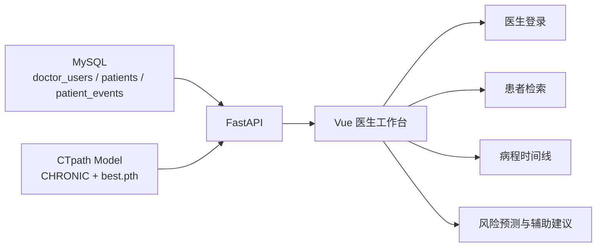

# 系统设计说明

## 系统定位

该项目将 CTpath 时序知识图谱推理模型迁移到慢病辅助诊疗场景，形成“模型 + 服务 + 前端 + 数据库”的完整闭环。

## 系统架构

## 数据库设计

### doctor_users

- 医生登录账号与基础身份信息

### patients

- 患者基本信息
- 主病种
- 当前阶段
- 风险等级
- 最后一次随访时间

### patient_events

- 患者时序事件
- 结构化关系：`has_disease`、`stage`、`med_adherence`、`support_system` 等
- 事件时间和事件备注

## 接口设计

- `POST /api/login`：医生登录并返回 token
- `GET /api/patients`：获取患者列表
- `GET /api/patient/{id}`：获取患者详情
- `GET /api/timeline/{id}`：获取独立时间线数据
- `POST /api/predict`：返回模型推理或案例辅助建议
- `GET /api/health`：查看当前后端模式和模型状态

## 降级策略

- 数据充分时：走 CTpath 模型推理
- 数据不足时：回退到相似病例辅助建议
- 数据库不可用时：回退到内置演示数据

这个策略适合复试答辩，因为它体现了系统的可用性和工程鲁棒性。
